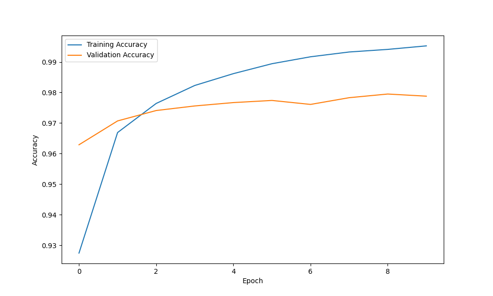
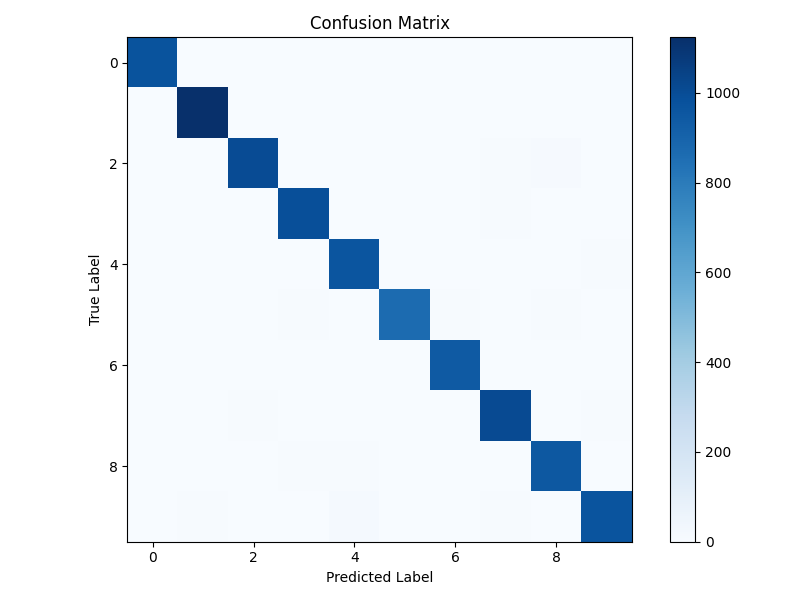

# MNIST Digit Classification with TensorFlow

This project implements a deep learning model to classify handwritten digits from the MNIST dataset using TensorFlow.

## Overview

The MNIST dataset consists of 70,000 grayscale images of handwritten digits (0-9), split into 60,000 training images and 10,000 testing images. Each image is 28x28 pixels. This project builds and trains a neural network to recognize these digits.

## Model Architecture

The neural network architecture used in this project consists of:

1. Input layer: 784 neurons (28x28 flattened)
2. Hidden layer 1: 128 neurons with ReLU activation
3. Output layer: 10 neurons (one for each digit) with softmax activation

## Results

The model demonstrates excellent performance on the MNIST dataset, achieving 99% accuracy on the test set. And a 97% accuracy on the validation/test set. Training dynamics reveal that:

- With just 5 epochs, the model reaches approximately 99% accuracy with a loss of around 5%
- Extending training to 10 epochs further improves accuracy to approximately 99.5%

Analysis of misclassifications through the confusion matrix reveals interesting patterns:

- The digit '5' presents the greatest classification challenge, consistent with findings from other neural network architectures I've implemented
- The digit '1' shows remarkable classification accuracy, with nearly zero misclassifications
- The remaining digits show relatively uniform error distribution

These results suggest that while the model performs exceptionally well overall, there are specific digit morphologies (particularly '5') that continue to present recognition challenges. This pattern of misclassification appears to be inherent to the digit's structure rather than a limitation specific to this implementation.

## Acknowledgments

- The MNIST dataset is a subset of a larger set available from NIST
- Thanks to Yann LeCun and Corinna Cortes for making the dataset available